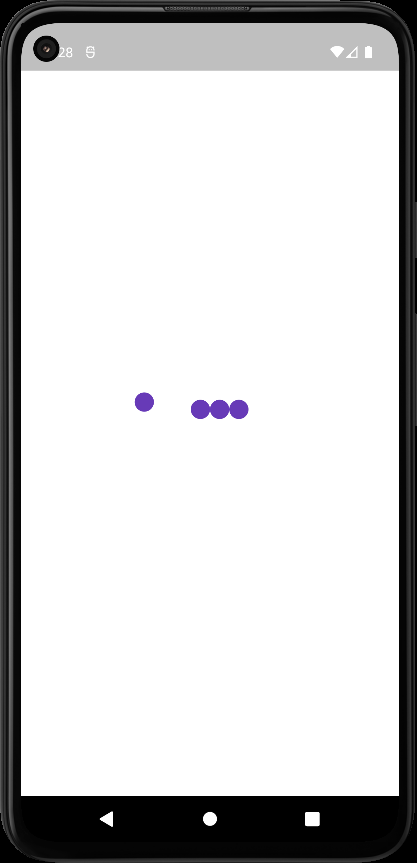
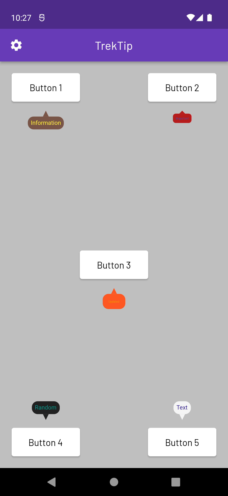
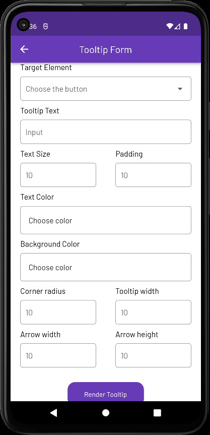
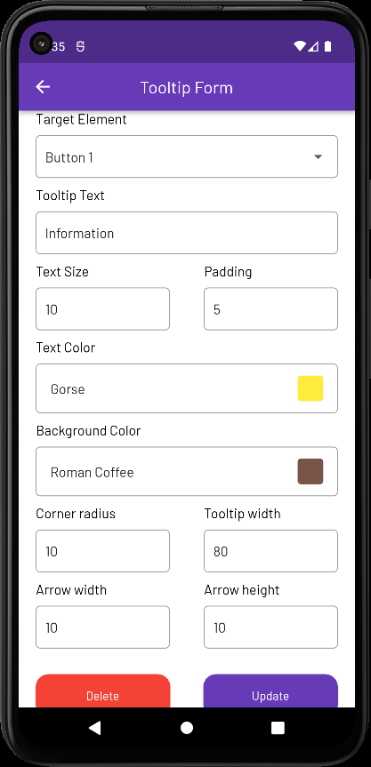
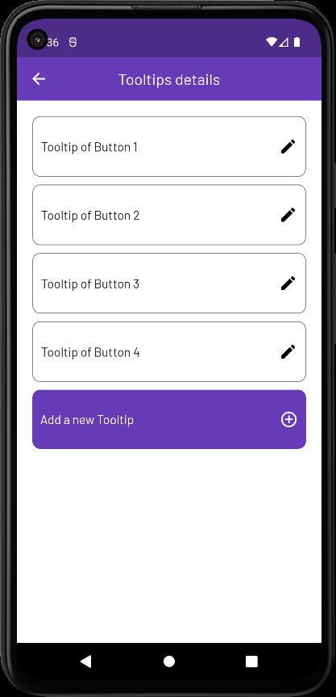
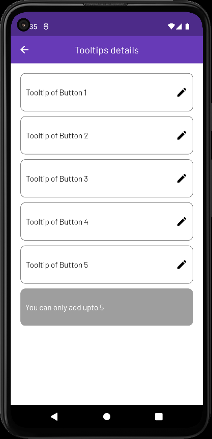

# Trektip App

Trektip is a mobile app built in Flutter for the Assignment round of Plotline. The app is designed to provide information to users in the form of tooltips.
The app allows users to customize tooltips and display them on the home screen.

## Screens

### 1. Splash Screen

Upon launching the app, users are greeted with a splash screen. Depending on whether the user has added any tooltips or not, the app will direct the user to either the form screen or the home screen.

 

### 2. Home Screen

The home screen is the main interface of the app. It displays a collection of buttons, each of which can trigger a tooltip when long-pressed. Tapping on the button will dismiss the tooltip.

### 3. Add or Update Form Screen

This screen allows users to add new tooltips or update existing ones. Users can enter details and information that they want to display in the tooltips. This enhances the customization of the tooltips according to the user's preferences.

#### Add Tooltip Form:

 

#### Edit Tooltip Form:

 

### 4. Edit Screen

On the edit screen, users can view a list of all the added tooltips. If the number of added tips is less than the number of available boxes on the home screen, users can also add new tooltip data; otherwise, the add tooltip button will get disabled.

#### Tool details screen when the number of tooltips added is less than the number of buttons present in the home screen:

 

#### Tool details screen when the number of tooltips added is equal to the number of boxes in the home screen:

 

## To start

To run the Trektip app locally, follow these steps:

1. Clone this repository.
2. Open the project in your preferred IDE or code editor.
3. run flutter pub get
5. Build and run the app on your emulator or device.
